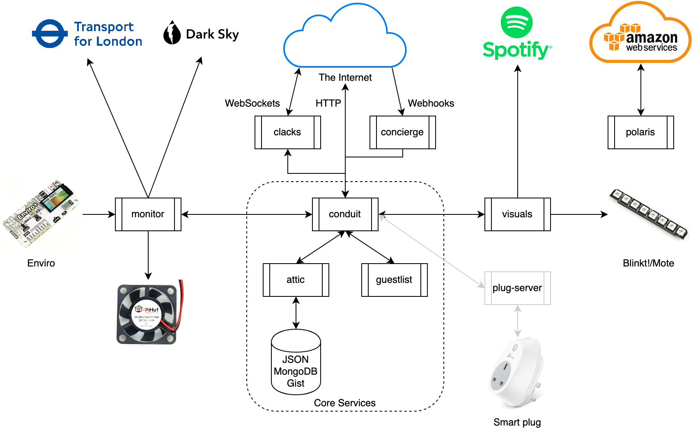

# node-microservices



This is an ongoing project (since September 2016) that encompasses a set of
small Node microservices that work together to deliver private and public
features. It was originally (and still is) run on a Raspberry Pi running
Raspbian, though nowadays it also runs in the cloud. The aim is to build a
reuable, extensible, and configurable architecture built 'from scratch' as
possible. Therefore elements like common modules, logging, configuration,
inter-app communication are of an original design.

* [Installation](#installation)
* [Launching Apps](#launching-apps)
* [App List](#app-list)
* [Dashboard List](#dashboard-list)
* [Common Modules](#common-modules)
* [Configuration](#configuration)
* [Communication](#communication)
* [Authentication](#authentication)


## Installation

For each app in `apps` or dashboard in `dashboards`, install dependencies and
perform initial startup:

1. `npm ci && npm start`

2. Finish setting up `config.json` that is generated.

Lastly, setup the `node-common` module, shared by all apps:

1. `cd node-common`

2. `npm ci`


## Launching Apps

Use `tools/runner.js` to launch a full set of apps:

```bash
node runner.js conduit attic visuals monitor
```


## App List

* [`attic`](apps/attic) - Data storage service that allows other apps to
  POST/GET app-specific data items, stored locally in a variety of formats
  (JSON, Gist, MongoDB, etc.).
* [`concierge`](apps/concierge) - API service that allows creation and deletion
  of webhook callbacks, and handles POST requests to those callbacks by saving
  payloads received, or forwarding them on via `conduit`.
* [`conduit`](apps/conduit) - API service that allows all the other apps to
  communicate, as well as providing a single entry-point for the outside world
  to communicate with any single app, using a standard message format.
* [`guestlist`](apps/guestlist) - API service that grants and checks user access
  tokens. Master access is granted via a local file for the admin.
* [`monitor`](apps/monitor) - The oldest service, runs plugins and scripts on a
  timed basis to perform generic tasks, including checking weather, train
  delays, uptime status of other services, and updating LED lights on schedule.
* [`plug-server`](apps/plug-server) - API service to control local smart
  devices, such as TP-Link Smart Plugs.
* [`visuals`](apps/visuals) - API service that provides an API between
  other services and the local LED lights hardware. Also provides animations and
  Spotify album art color integration.
* [`clacks`](apps/clacks) - Simple WebSocket server to allow persistent
  connections from apps, dashboards, webapps etc over WS protocol.
* [`polaris`](apps/polaris) - Service that monitors the local network's public
  IP address and keeps an AWS Route53 record in sync, removing the need for a
  permanent IP to be assigned from the ISP.


## Dashboard List

* [`service-dashboard`](apps/service-dashboard) - React application that shows
  the status of all local apps running through `conduit`, and provides a GUI for
  their APIs. For example, setting colors for `visuals`.
* [`lighting-dashboard`](apps/service-dashboard) - React application showing an
  easy to use card of colors and shortcuts for `visuals` APIS, such as Spotify
  mode.


## Common Modules

The [`node-common`](node-common) project contains a set of modules that are
commonly used across all of these apps for purposes such as API requests, data
storage, configuration behavior, etc. It is published as an `npm` module for
easy reuse. It also includes a full set of tests, with minimal configuration
required.

However, apps that don't want to use the published module can use a copy of
`node-common.js` to require them in a pseudo-local manner:

```js
const { log, conduit } = require('../node-common')(['log', 'conduit']);
```


## Configuration

Each app has a `config-default.json` that is created if no `config.json` exists,
and in most cases the app will function normally. However, apps that require
special keys (Spotify, API keys etc.) will not. Each module uses
`config.addPartialSchema()` to declare a partial schema that must exist in the
app's config file, or else it will not start. For example, app logging:

```js
config.addPartialSchema({
  required: ['DB'],
  properties: {
    DB: {
      required: ['FILE'],
      properties: {
        FILE: { type: 'string' },
      },
    },
  },
});

const { DB } = config.get(['DB']);
```

Apps must then use `validate()` during startup to validate the whole and to
discover unused keys.


## Communication

The common `conduit` module provides easy access to the locally (or even
remotely) running instance of the `conduit` app, which assigns apps random ports
and forwards all messages between them. Apps start by registering and receiving
a port for their own internal web server. Then they register topics they will
respond to (i.e: their API), and optionally provide a schema for those messages
other clients may attempt to send. For example, the `visuals` API:

```js
// Connect and get port
await conduit.register({ appName: 'visuals' });

// Register listeners for topics, and declare schema for those topic's messages
conduit.on('setAll', require('../api/setAll'), SET_ALL_MESSAGE_SCHEMA);
conduit.on('setPixel', require('../api/setPixel'), INDEXED_MESSAGE_SCHEMA);
conduit.on('blink', require('../api/blink'), INDEXED_MESSAGE_SCHEMA);
```

Then, message can be replied to within the handler with the `conduit` common
module:

```js
// For the 'setAll' topic
module.exports = (packet, res) => {
  // Update the LEDs hardware
  leds.setAll(packet.message.all);

  // Respond to the packet sender
  conduit.respond(res, { status: 200, message: { content: 'OK' } });
};
```

### Testing Communication

The `tools/conduit.sh` script can be used to easily send such a message to an
app. For example:

```bash
# Fade to black
./conduit.sh localhost visuals fadeAll '{"all": [0, 0, 0]}'

# Is equivalent to:
curl -X POST localhost:5959/conduit \
  -H Content-Type:application/json \
  -d '{
    "to": "visuals",
    "topic": "fadeAll",
    "message": {
      "all": [0, 0, 0]
    }
  }'
```

The last parameter (message) is optional for packets that don't require it,
such as status checks:

```bash
./conduit.sh localhost attic status
```

The only exception is when a `guestlist` auth token is required (i.e: when not
from `localhost`), when it can be left empty and the last parameter is `auth`
instead:

```bash
# Get some data from outside with an auth token
./conduit.sh 48.192.67.201 attic get '{"app":"TestApp","key":"itemList"}' fa874c2f584dac2f3e68e6aa5f27d75ac208a88e

# Is equivalent to
curl -X POST http://48.192.67.201:5959/conduit \
  -H Content-Type:application/json \
  -d '{
    "to": "attic",
    "topic": "get",
    "auth": "fa874c2f584dac2f3e68e6aa5f27d75ac208a88e",
    "message": {
      "app": "TestApp",
      "key": "itemList"
    }
  }'
```


## Authentication

For all requests that do not originate from `localhost`, each packet received
by `conduit` must include the `auth` field with a token that can is then
verified by `guestlist`, though this can be disabled. Where applicable
additional checks are done on the `apps` and `topics` permissions assigned to
that user.

For example, creating a user as the sysadmin with the master password (see
[`guestlist`](apps/guestlist) for details):

```json
{
  "to": "guestlist",
  "topic": "create",
  "auth": "MyAdminPassword",
  "message": {
    "name": "BacklightUser",
    "apps": ["visuals"],
    "topics": ["set", "fadeAll", "off"]
  }
}
```

The response will contain a one-time view of the token that may be given to the
user for their requests:

```json
{
  "status": 201,
  "message": {
    "id": "165dacd16a253b28",
    "name": "BacklightUser",
    "apps": ["visuals"],
    "topics": ["set","fadeAll","off"],
    "token": "b6aacf6f46dbdd24659b537f7754506eb4aa5638",
    "createdAt": 1586599862140
  }
}
```

Such an example request simply uses the token as the `auth` parameter:

```json
{
  "to": "visuals",
  "topic": "off",
  "auth": "b6aacf6f46dbdd24659b537f7754506eb4aa5638"
}
```

## Run tests

Run all app and common module tests in Docker:

```shell
./tools/docker-test.sh
```


## History

What began as a Python script that used the Pebble timeline API to warn me of
train delays and adverse weather conditions, then encompassed the Pebble
timeline pin-pushing apps for News Headlines and Tube Status, before becoming a
personal project to assemble a collection of apps that worked together to do
interesting things, including a novel system of communication for them all.
