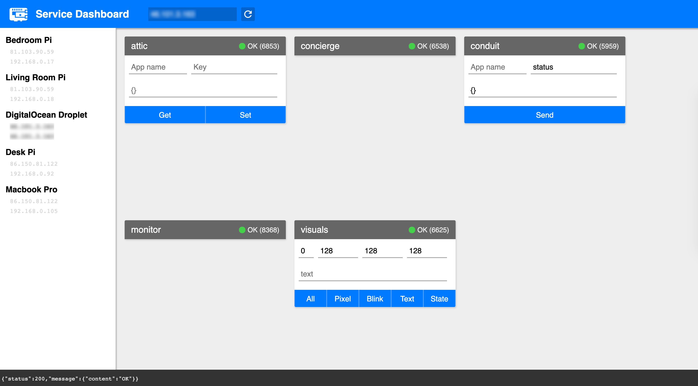

# service-dashboard

React-based web application providing specialised interaction UI for the APIs
presented by my various Node microservices, such as
[attic](https://github.com/c-d-lewis/attic) or
[visuals](https://github.com/c-d-lewis/visuals).
